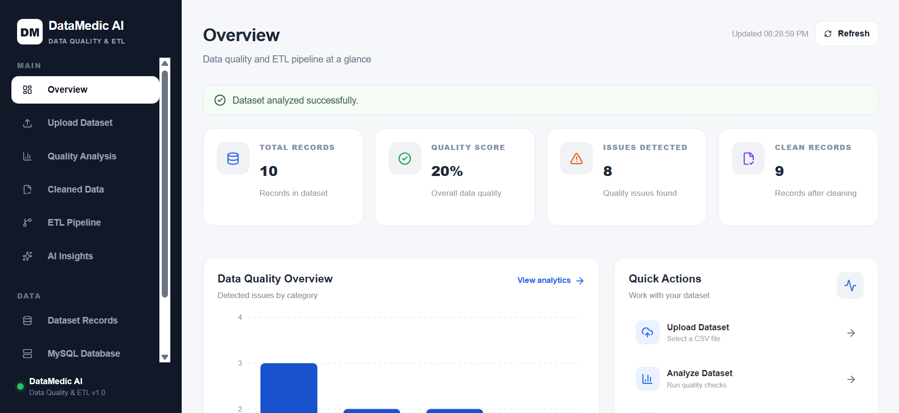
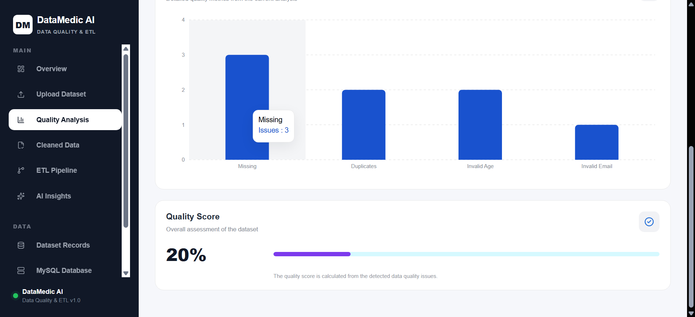
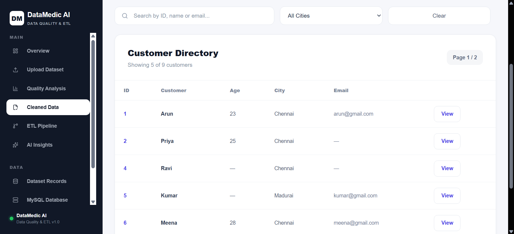
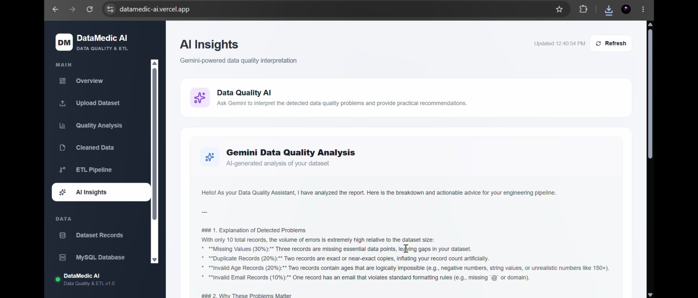
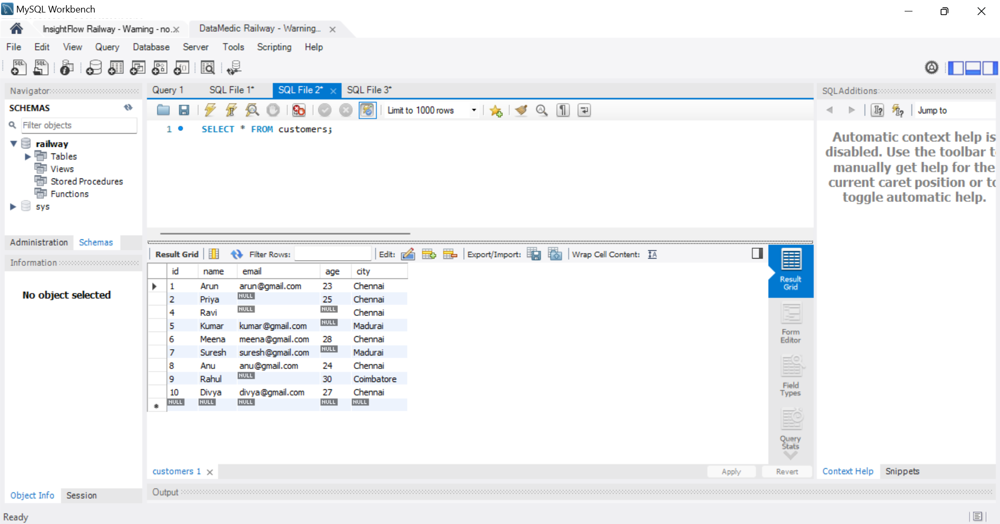

# 🩺 DataMedic AI

## AI-Assisted Data Quality & ETL Platform

DataMedic AI is an AI-assisted **data quality and data engineering platform** that helps identify, analyze, clean, transform, and store raw customer data through an interactive web dashboard.

The platform combines **Python, Pandas, FastAPI, React, MySQL, and Gemini AI** to create an end-to-end data-quality and ETL workflow.

It detects common data-quality issues, generates quality reports, cleans and standardizes records, loads transformed data into MySQL, and uses Gemini to provide human-readable explanations and recommendations.

---

## 🌐 Live Demo

🔗 **[DataMedic AI — Live Demo](https://datamedic-ai.vercel.app/)**

The application is deployed with:

- **Frontend:** Vercel
- **Backend:** Railway
- **Database:** Railway MySQL

---

## 🔗 Repository

📂 **GitHub:**  
https://github.com/JoshuaDaniel06/DataMedic-ai

---

## 📸 Screenshots

### Dashboard



### Quality Analysis



### Cleaned Data



### AI Insights



### MySQL Database



> Add the screenshots to the `screenshots/` folder using the filenames shown above.

---

# 🎯 Problem Statement

Raw customer data often contains quality problems before it can be reliably used for analytics or database storage.

Common problems include:

- Missing values
- Duplicate records
- Invalid ages
- Invalid email addresses
- Inconsistent city names
- Formatting inconsistencies

Manually finding and fixing these issues can be time-consuming.

DataMedic AI automates this process through a data-quality and ETL pipeline.

The platform can:

```text
Raw Customer Data
        ↓
Data Quality Analysis
        ↓
Cleaning & Transformation
        ↓
Quality Report
        ↓
MySQL
        ↓
AI Explanation
```

---

# ✨ Key Features

## 🔹 Data Engineering & ETL

-  CSV data ingestion 
-  Data validation 
-  Data cleaning 
-  Data transformation 
-  Duplicate detection 
-  Missing-value detection 
-  Data standardization 
-  Quality report generation 
-  MySQL database loading 

---

## 🔹 Data Quality Analysis

DataMedic AI checks uploaded datasets for:

-  Missing values 
-  Duplicate customer records 
-  Duplicate email addresses 
-  Invalid age values 
-  Invalid email formats 
-  Inconsistent city formatting 

The results are displayed through the interactive dashboard.

---

## 🔹 Automated Data Cleaning

The cleaning pipeline can:

-  Remove duplicate customer records 
-  Convert invalid ages to missing values 
-  Convert invalid email values to missing values 
-  Standardize city names 
-  Prepare transformed records for database loading 

The cleaned dataset can be downloaded as:

```
cleaned_customers.csv
```

---

## 🔹 Data Quality Report

DataMedic AI generates a structured JSON quality report.

Example:

```
{
  "total_records": 10,
  "missing_values": 3,
  "duplicate_records": 2,
  "invalid_age_records": 2,
  "invalid_email_records": 1,
  "quality_score": 20.0
}
```

The actual values depend on the uploaded dataset.

---

## 🔹 Interactive Dashboard

The React dashboard provides:

-  Dataset records 
-  Customer search 
-  Search by ID, name, or email 
-  City filtering 
-  Pagination 
-  Cleaned-data preview 
-  Quality statistics 
-  Quality score 
-  Detected issue summaries 
-  CSV download 
-  ETL pipeline status 
-  MySQL loading 
-  AI-generated insights 
-  Processing feedback 
-  Error handling 

---

## 🔹 MySQL Integration

Cleaned customer records can be loaded into MySQL through the application.

```
Cleaned Customer Data
        │
        ▼
      MySQL
        │
        ▼
 customers table
```

This allows the project to demonstrate a complete:

```
ETL → Database → Analytics
```

workflow.

---

## 🔹 Gemini AI Analysis

Gemini is used as an **interpretation layer** after deterministic data-quality processing.

It provides:

-  Explanation of detected problems 
-  Why the issues matter 
-  Recommended actions 
-  Overall dataset assessment 

The actual data-quality rules remain deterministic and are handled by Python and Pandas.

```
Python + Pandas
       │
       ▼
Data Quality Rules
       │
       ▼
Quality Report
       │
       ▼
Gemini AI
       │
       ▼
Explanation + Recommendations
```

---

# 🏗️ System Architecture

```
                    ┌─────────────────────┐
                    │   Raw Customer CSV  │
                    └──────────┬──────────┘
                               │
                               ▼
                    ┌─────────────────────┐
                    │   React Dashboard   │
                    └──────────┬──────────┘
                               │
                               ▼
                    ┌─────────────────────┐
                    │   FastAPI Backend   │
                    │      REST API       │
                    └──────────┬──────────┘
                               │
                               ▼
                    ┌─────────────────────┐
                    │   Python + Pandas   │
                    │   Data Processing   │
                    └──────────┬──────────┘
                               │
                               ▼
             ┌────────────────────────────────┐
             │       Data Quality Checks       │
             │                                │
             │ • Missing Values               │
             │ • Duplicate Records            │
             │ • Invalid Ages                 │
             │ • Invalid Emails               │
             │ • City Standardization         │
             └───────────────┬────────────────┘
                             │
                             ▼
                    ┌─────────────────────┐
                    │ Data Cleaning &      │
                    │ Standardization      │
                    └──────────┬──────────┘
                               │
                    ┌──────────┴──────────┐
                    │                     │
                    ▼                     ▼
             ┌──────────────┐      ┌──────────────┐
             │ Quality      │      │ MySQL        │
             │ Report JSON  │      │ Database     │
             └──────┬───────┘      └──────────────┘
                    │
                    ▼
             ┌──────────────┐
             │ Gemini API   │
             │ AI Analysis  │
             └──────┬───────┘
                    │
                    ▼
             ┌──────────────────────┐
             │ AI Explanation &     │
             │ Recommendations      │
             └──────────────────────┘
```

---

# 🧠 AI Architecture

DataMedic AI separates **deterministic data processing** from **generative AI interpretation**.

```
Raw Dataset
     │
     ▼
Python + Pandas
     │
     ▼
Data Quality Rules
     │
     ├── Missing Values
     ├── Duplicate Detection
     ├── Age Validation
     ├── Email Validation
     └── City Standardization
     │
     ▼
Quality Report
     │
     ▼
Gemini AI
     │
     ▼
Explanation
     │
     ▼
Recommendations
```

This architecture keeps the actual validation and transformation predictable while using Gemini for natural-language interpretation.

---

# 🔄 ETL Pipeline

DataMedic AI follows a practical ETL workflow.

```
01  CSV Input
       │
       ▼
02  Quality Analysis
       │
       ▼
03  Data Cleaning
       │
       ▼
04  MySQL Load
       │
       ▼
05  AI Insights
```

### Extract

Customer data is extracted from a CSV file using Python and Pandas.

### Transform

The pipeline performs:

-  Validation 
-  Cleaning 
-  Standardization 
-  Duplicate detection 
-  Missing-value detection 
-  Business-rule validation 

### Load

The cleaned records are loaded into MySQL.

```
CSV
 ↓
Extract
 ↓
Transform
 ↓
Load
 ↓
MySQL
```

---

# 🔍 Data Quality Rules

## Missing Values

Missing values are identified using Pandas.

```
df.isnull().sum()
```

This helps identify incomplete customer records.

---

## Duplicate Customers

Duplicate customer records are checked using email addresses.

```
df.duplicated(subset=["email"], keep=False)
```

Null email values are excluded from duplicate-email detection.

---

## Invalid Ages

Ages outside the range `0–120` are treated as invalid.

```
(df["age"] < 0) | (df["age"] > 120)
```

Invalid age values are converted to missing values during cleaning.

---

## Invalid Emails

A basic validation rule checks whether non-null email values contain:

```
@
.
```

For example:

```
ravi@gmail
```

is identified as an invalid email value.

Invalid email values are converted to missing values during cleaning.

---

## City Standardization

City names are standardized using:

```
df["city"] = (
    df["city"]
    .str.strip()
    .str.title()
)
```

For example:

```
CHENNAI
 Chennai
chennai
```

becomes:

```
Chennai
```

---

# 📊 Example Data Flow

Example input:

```
ID: 7
Name: Suresh
Age: -5
City: Madurai
Email: suresh@gmail.com
```

The quality engine identifies:

```
Invalid age
```

During cleaning, the invalid age is converted to a missing value.

Similarly:

```
" Chennai"
"CHENNAI"
"chennai"
```

is standardized to:

```
"Chennai"
```

---

# 📈 Data Quality Report

For the included sample dataset, the quality engine identifies issues such as:

```
Total records: 10
Missing values: 3
Duplicate records: 2
Invalid ages: 2
Invalid emails: 1
Quality Score: 20.0%
```

The cleaned dataset contains 9 records after duplicate removal.

The quality report is generated as JSON and can be passed to the Gemini analysis layer.

> The values above represent the sample dataset. Results change when another CSV file is uploaded.

---

# 🤖 AI-Powered Insights

After the quality analysis is completed, the generated report is sent to Gemini.

The AI receives structured information such as:

```
Total Records
Missing Values
Duplicate Records
Invalid Ages
Invalid Emails
Quality Score
```

Gemini then provides:

### Explanation

Explains what the detected data-quality problems mean.

### Impact

Explains why the issues can matter for data processing and analytics.

### Recommendations

Suggests practical corrective actions.

### Overall Assessment

Provides a human-readable summary of the dataset quality.

The LLM does **not** replace the underlying validation engine.

---

# 🗄️ MySQL Integration

DataMedic AI stores cleaned customer data in MySQL.

```
Raw Dataset
     │
     ▼
Quality Checks
     │
     ▼
Data Cleaning
     │
     ▼
Standardization
     │
     ▼
MySQL
     │
     ▼
customers
```

### Example SQL Queries

View all customers:

```
SELECT * FROM customers;
```

Count loaded records:

```
SELECT COUNT(*)
FROM customers;
```

Group records by city:

```
SELECT city, COUNT(*)
FROM customers
GROUP BY city;
```

View customer information:

```
SELECT name, city
FROM customers;
```

The production database can also be inspected using MySQL Workbench.

---

# 📊 Dashboard

The dashboard provides a centralized interface for the complete workflow.

### Overview

Displays the main dataset and quality information.

### Upload Dataset

Allows users to upload a CSV file for analysis.

### Quality Analysis

Displays:

-  Total records 
-  Missing values 
-  Duplicate records 
-  Invalid ages 
-  Invalid emails 
-  Quality score 
-  Issue summaries 

### Cleaned Data

Allows users to inspect transformed records and download the cleaned CSV.

### ETL Pipeline

Displays the progress of:

```
CSV
 ↓
Analysis
 ↓
Cleaning
 ↓
MySQL
 ↓
AI Insights
```

### Dataset Records

Provides customer record search, filtering, and pagination.

### MySQL Database

Shows the database-loading stage and database information.

### AI Insights

Displays Gemini-generated explanations and recommendations.

---

# 🌐 Backend API

DataMedic AI uses FastAPI for the backend REST API.

| Method | Endpoint       | Purpose                         |
| ------ | -------------- | ------------------------------- |
| `GET`  | `/`            | API root/health response        |
| `POST` | `/analyze`     | Analyze uploaded CSV            |
| `POST` | `/ai-insights` | Generate Gemini AI analysis     |
| `POST` | `/clean`       | Generate/download cleaned CSV   |
| `POST` | `/load`        | Load cleaned records into MySQL |

FastAPI provides interactive API documentation at:

```
http://127.0.0.1:8000/docs
```

---

# 🛠️ Technology Stack

## Backend

-  Python 
-  FastAPI 
-  Pandas 
-  MySQL Connector/Python 
-  python-dotenv 

## Frontend

-  React 
-  Vite 
-  Axios 
-  Recharts 
-  Lucide React 
-  CSS 

## Database

-  MySQL 
-  SQL 
-  MySQL Workbench 

## AI

-  Google Gemini 
-  Google GenAI SDK 
-  AI-assisted data-quality interpretation 

## Data Engineering

-  CSV ingestion 
-  ETL 
-  Data cleaning 
-  Data validation 
-  Data transformation 
-  Data-quality reporting 
-  Database loading 

## Deployment

-  Git 
-  GitHub 
-  Vercel 
-  Railway 
-  Railway MySQL 

---

# 📁 Project Structure

```
datamedic-ai/
│
├── README.md
├── LICENSE
├── .gitignore
├── requirements.txt
├── customers.csv
│
├── llm_assistant.py
├── load_mysql.py
│
├── backend/
│   ├── main.py
│   ├── database.py
│   └── data_quality.py
│
├── frontend/
│   ├── src/
│   │   ├── App.jsx
│   │   ├── App.css
│   │   └── index.css
│   │
│   ├── package.json
│   ├── index.html
│   ├── vite.config.js
│   └── eslint.config.js
│
├── screenshots/
│   ├── dashboard.png
│   ├── quality-analysis.png
│   ├── cleaned-data.png
│   ├── ai-insights.png
│   └── mysql-database.png
│
└── ...
```

### Important Files

| File / Folder             | Purpose                                                   |
| ------------------------- | --------------------------------------------------------- |
| `backend/main.py`         | FastAPI backend and REST API                              |
| `backend/data_quality.py` | Data-quality analysis and cleaning                        |
| `backend/database.py`     | MySQL connectivity and database operations                |
| `llm_assistant.py`        | Gemini API integration                                    |
| `load_mysql.py`           | Loads cleaned records into MySQL                          |
| `customers.csv`           | Sample customer dataset                                   |
| `frontend/`               | React/Vite dashboard                                      |
| `screenshots/`            | Project screenshots                                       |
| `requirements.txt`        | Python dependencies                                       |
| `.gitignore`              | Prevents sensitive/unnecessary files from being committed |

> Never commit `.env`, API keys, passwords, or other secrets to GitHub.

---

# 💻 Installation

## Prerequisites

Install:

-  Python 3.11+ 
-  Node.js 
-  npm 
-  MySQL 

---

## 1. Clone the Repository

```
git clone https://github.com/JoshuaDaniel06/DataMedic-ai.git
cd DataMedic-ai
```

---

## 2. Create a Python Virtual Environment

```
python -m venv venv
```

### Windows

```
venv\Scripts\activate
```

---

## 3. Install Backend Dependencies

```
pip install -r requirements.txt
```

---

## 4. Install Frontend Dependencies

```
cd frontend
npm install
```

Return to the project root:

```
cd ..
```

---

# 🔐 Environment Variables

Create a `.env` file in the project root.

```
GEMINI_API_KEY=your_gemini_api_key

MYSQL_HOST=localhost
MYSQL_USER=your_mysql_username
MYSQL_PASSWORD=your_mysql_password
MYSQL_DATABASE=datamedic
```

### Security

Never commit `.env` to GitHub.

Your `.gitignore` should contain:

```
.env
*.db
__pycache__/
*.pyc
.venv/
venv/
.vscode/
node_modules/
```

If an API key is accidentally exposed, revoke it and generate a new one.

---

# 🗄️ Local MySQL Setup

Create the database:

```
CREATE DATABASE datamedic;
```

Select the database:

```
USE datamedic;
```

The main customer table contains fields such as:

```
customers
├── id
├── name
├── email
├── age
└── city
```

Make sure MySQL is running before loading data.

---

# ▶️ Running Locally

## Start Backend

From the project root:

```
cd backend
uvicorn main:app --reload
```

Backend:

```
http://127.0.0.1:8000
```

FastAPI documentation:

```
http://127.0.0.1:8000/docs
```

---

## Start Frontend

Open another terminal:

```
cd frontend
npm run dev
```

The Vite development server will display the local frontend URL, normally:

```
http://localhost:5173
```

---

# 🔄 Complete Application Workflow

```
                    CSV Upload
                        │
                        ▼
                Data Quality Analysis
                        │
                        ▼
                  Quality Report
                        │
                        ▼
              Clean & Standardize
                        │
                        ▼
                 Cleaned Dataset
                   /          \
                  /            \
                 ▼              ▼
        Download CSV          MySQL
                                │
                                ▼
                           AI Insights
                                │
                                ▼
                         Gemini Explanation
```

---

# ☁️ Deployment

DataMedic AI is deployed as a full-stack application.

```
                    User
                     │
                     ▼
              Vercel Frontend
                     │
                     ▼
              Railway Backend
                     │
                     ▼
              Railway MySQL
```

### Frontend

Hosted on:

**Vercel**

### Backend

Hosted on:

**Railway**

### Database

Hosted on:

**Railway MySQL**

The deployed frontend communicates with the production FastAPI backend through the configured API URL.

---

# 🔒 Data & AI Safety

DataMedic AI keeps the core data-quality processing deterministic.

### Deterministic Processing

Python and Pandas handle:

-  Validation 
-  Cleaning 
-  Duplicate detection 
-  Missing-value detection 
-  Standardization 
-  Data transformation 

### AI Processing

Gemini handles:

-  Explanation 
-  Interpretation 
-  Recommendations 
-  Human-readable summaries 

This separation prevents the LLM from being responsible for the fundamental data-cleaning rules.

---

# 🎓 Data Engineering Concepts Demonstrated

DataMedic AI demonstrates practical experience with:

-  Data ingestion 
-  ETL development 
-  Data validation 
-  Data quality assessment 
-  Data cleaning 
-  Data transformation 
-  Duplicate detection 
-  Missing-value detection 
-  Data standardization 
-  CSV processing 
-  JSON reporting 
-  SQL 
-  MySQL 
-  REST APIs 
-  FastAPI 
-  Database integration 
-  Generative AI 
-  API integration 
-  Environment-based configuration 
-  Error handling 

---

# 📌 Project Status

**Status: Completed and Deployed**

The current version includes:

-  CSV upload 
-  Data-quality analysis 
-  Automated cleaning 
-  Cleaned-data preview 
-  CSV download 
-  MySQL integration 
-  ETL workflow 
-  Gemini AI insights 
-  React dashboard 
-  FastAPI backend 
-  Responsive mobile layout 
-  Vercel deployment 
-  Railway backend 
-  Railway MySQL 

---

# 🚀 Future Improvements

Potential future enhancements include:

-  Excel input support 
-  JSON input support 
-  Automated scheduled pipelines 
-  Additional data-quality rules 
-  Data lineage tracking 
-  Structured logging 
-  PostgreSQL support 
-  Apache Airflow integration 
-  PySpark processing for larger datasets 
-  Cloud storage integration 
-  Data warehouse integration 
-  Automated anomaly detection 
-  Advanced AI-assisted data-quality recommendations 

---

# 🎯 Project Goal

DataMedic AI was built to demonstrate how **Data Engineering, ETL, Data Quality, MySQL, APIs, and Generative AI** can be combined into one practical application.

The architecture follows:

```
Python
   +
Pandas
   +
ETL
   +
MySQL
   +
FastAPI
   +
React
   +
Gemini AI
```

The key principle is:

```
Rules → Python
Storage → MySQL
API → FastAPI
Interface → React
Explanation → Gemini
```

This makes DataMedic AI more than a simple CSV-cleaning script. It demonstrates an end-to-end data engineering workflow with an AI-assisted interpretation layer.

---

# 📄 License

This project is licensed under the **MIT License**.

See the `LICENSE` file for details.

---

# 🙏 Acknowledgements

-  Python 
-  Pandas 
-  FastAPI 
-  React 
-  Vite 
-  MySQL 
-  Google Gemini 
-  Recharts 
-  Lucide React 
-  Vercel 
-  Railway 

---

# 👨‍💻 Author

## Joshua Daniel

**Aspiring Data Engineer**

Interested in:

```
Data Engineering
ETL
Python
SQL
MySQL
Pandas
FastAPI
PySpark
Generative AI
```